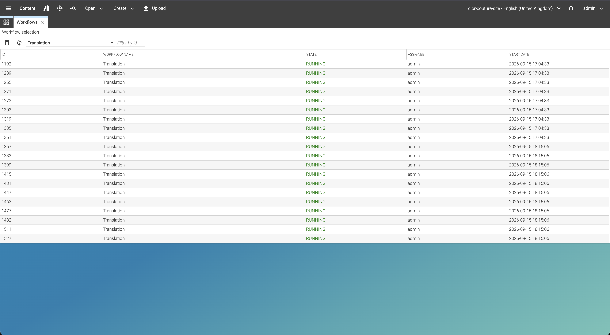
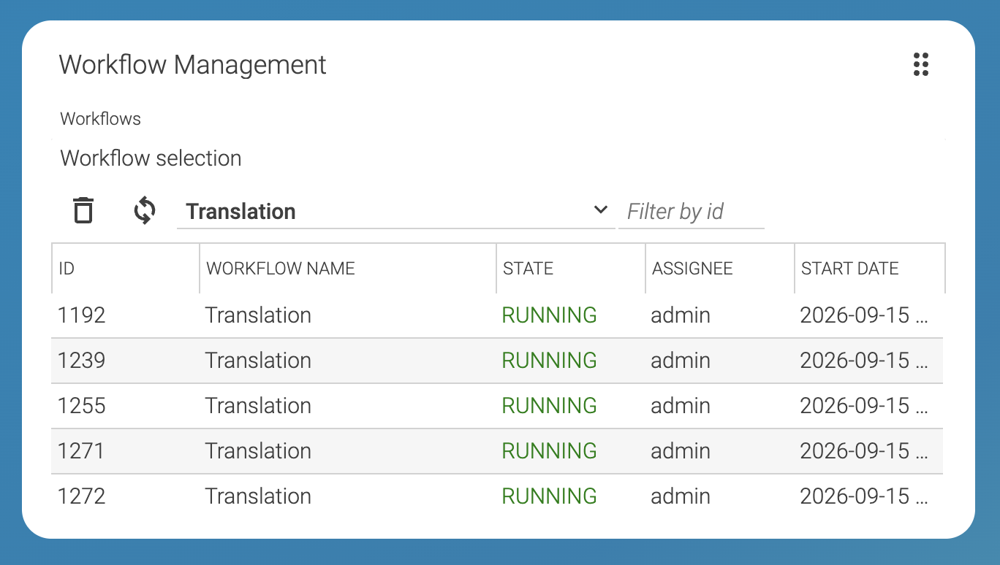

# Editorial Quick Start

--------------------------------------------------------------------------------

\[[Up](README.md)\] \[[Top](#top)\]

--------------------------------------------------------------------------------

## Table of contents

* [Introduction](#introduction)
* [Usage](#usage) 

# Introduction
The CoreMedia workflow management plugin provides a workflow management panel, enabling the configured groups of editors to delete a running or escalated workflow.

## Usage
The plugin can be used in two different ways, either as a panel or as a dashboard widget in studio.

The Picture below is showing the implementation as Panel

And as second, the dashboad.

This plugin is offering the ability to delete workflows. Per design, multi-selection is possible. On the upper left,
two buttons are displayed. The first button is to start the deletion, the second for updating the list of running processes
per workflow, or workflow category. 
Next to the refresh button, the workflow selection (Combobox) is rendered, and at last, a filter field for a given id.
